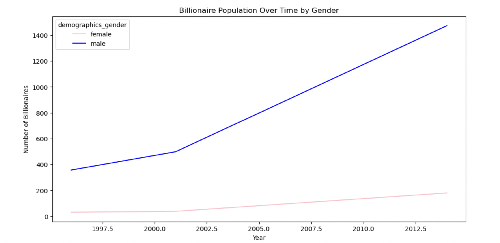
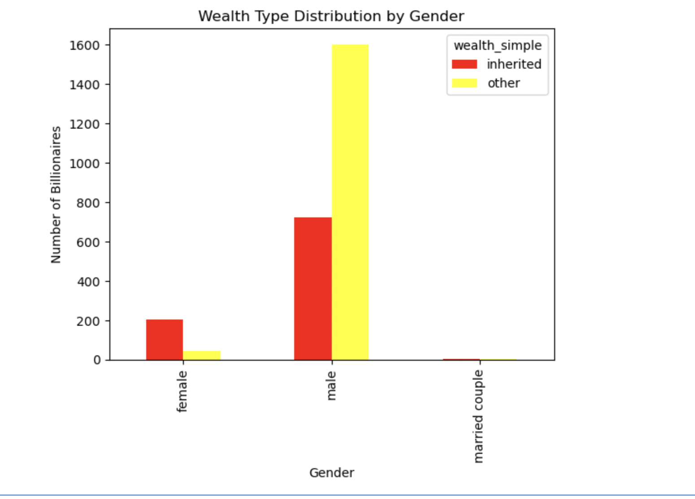
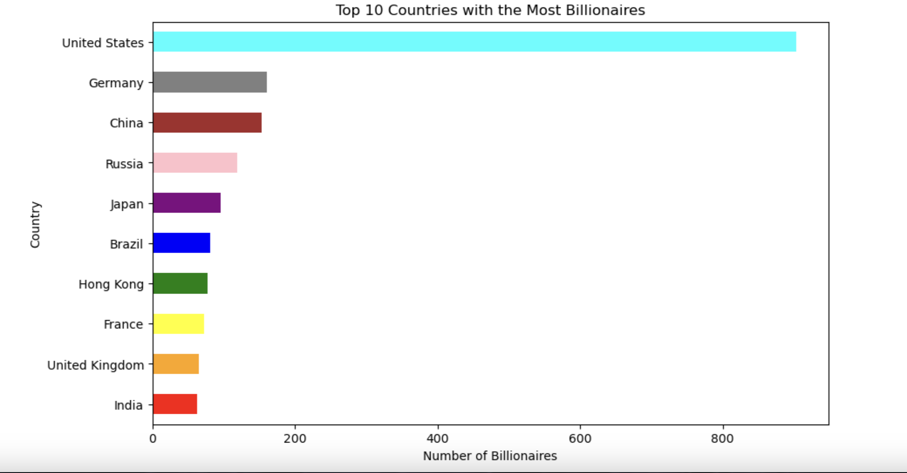
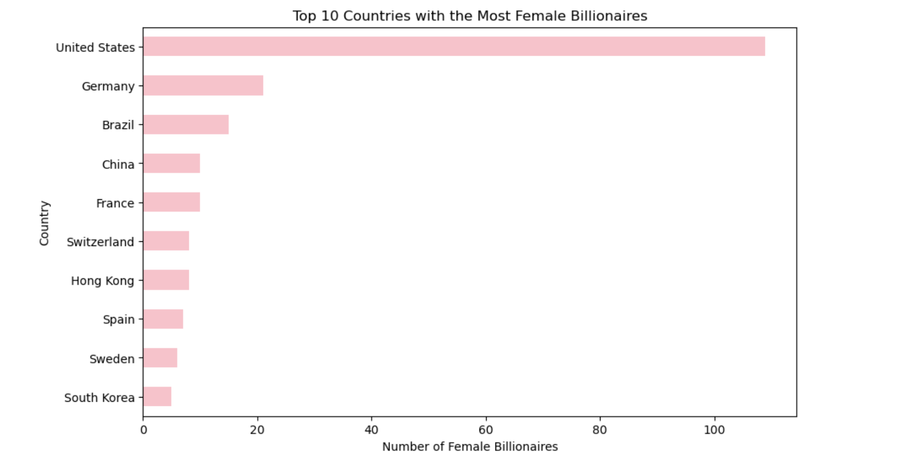
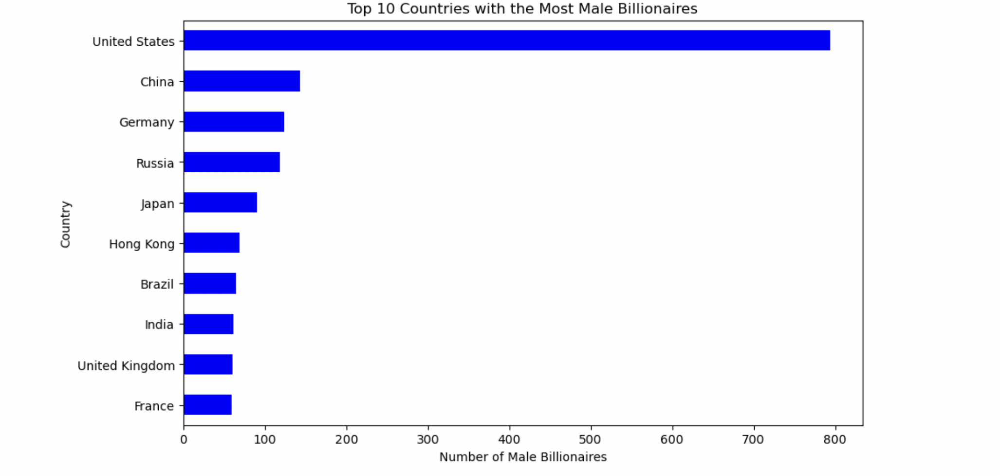

# The Gender of Billionaire Wealth : Who gets rich, where and how 

Reaching the 4,000 people mark, billionaires represent one of the smallest and most powerful groups in the global economy. But behind that number lies a more complicated picture, one shaped by gender, geography, industry, and inheritance.

## A world still dominated by men
The clearest pattern in this story is the gender gap. When we look at the number of billionaires by gender, men make up the vast majority of the list.

Women only make up a small part of all billionaires. This difference is not just about numbers, it also points to differences in access to money, leadership roles, and opportunities to build or grow large businesses.

## A growing gap 
Over time, the number of billionaires keeps growing, almost like a steady climb that never really flattens out.

The line for men rises quickly and consistently, almost like a fast-moving current building on itself year after year. It starts growing early and just keeps going upward.

The line for women follows the same direction, but it moves more slowly, like it’s trying to catch up but never quite closing the distance. It does grow, and that growth is important, but it starts from a much smaller base.

What really stands out is the space between the two lines. Even as both rise together over time, they never truly come close. It’s like two paths moving in the same direction, but one always stays far ahead of the other.

## The different pathways 
The difference between inherited wealth and everything else shows two very different ways people become billionaires.

For men, most wealth comes from building it themselves. They start companies, invest, and grow businesses over time. This is the largest group, showing that men are more often connected to creating new wealth rather than simply receiving it. There are still men who inherit their wealth, and this group is not small, but it is clearly not the main source compared to self-made fortunes.

For women, the pattern looks different. A larger share of female billionaires come from inherited wealth. This means many women reach billionaire status through family money or wealth passed down through generations. Self-made women do exist, but they are much fewer compared to men, making them stand out more in the data.

 This shows a clear difference in how wealth is built and passed on. Men are more represented in creating new fortunes through business and investment, while women are more often connected to inherited wealth. This highlights not just a gap in numbers, but also in the paths people take to reach extreme wealth.

## A few countries, most of the wealth 
The same idea of imbalance doesn’t stop at gender, it extends outward into geography, shaping where billionaire wealth actually appears on the map.

If we move from individuals to countries, the pattern becomes just as uneven. The concentration is not only in the hands of men, but also in the hands of a few countries around the world.

At the very top, the United States sits in a position that feels almost unmatched. It is not just leading the list, it defines it. A large share of the world’s billionaires are based there, making it feel less like one country among many and more like the central hub of global wealth creation. The scale is so dominant that everything else appears to orbit around it.

What becomes clear is that billionaire wealth is clustered in a handful of dominant regions rather than evenly distributed across the world. Just like the gender gap shows one group consistently ahead, geography tells a similar story: a small number of countries hold a disproportionate share of global billionaire wealth, while most of the world remains far behind.

## Where wealth lives
Billionaire wealth doesn’t spread evenly, it clusters, and the difference between men and women becomes clear the moment you follow that trail.

The United States stands at the center for both, but the experience diverges quickly. For men, it’s the anchor of a vast and far-reaching network that stretches across countries like China, Germany, and India. Their presence feels widespread, as if there are many doors into extreme wealth, across industries and regions.

For women, the map is tighter. The same major countries appear, like the United States, Germany, and France, but the path into wealth is less varied and more concentrated.

So while both men and women exist within the same global centers of wealth, they don’t move through them in the same way. One story spreads outward. The other stays confined to a smaller set of paths.

## The story beneath the numbers
Taken together, this isn’t just a story about billionaires.

It’s a story about access.

About who gets the chance to take risks, to build companies, to scale ideas into empires. About who is already standing close to wealth, and who has to travel much farther to reach it.

It’s also a story about systems that reinforce themselves. Wealth creates opportunity, and opportunity creates more wealth, but not everyone starts from the same place within that cycle.

> Author : Alessandra Ren